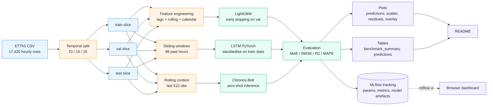
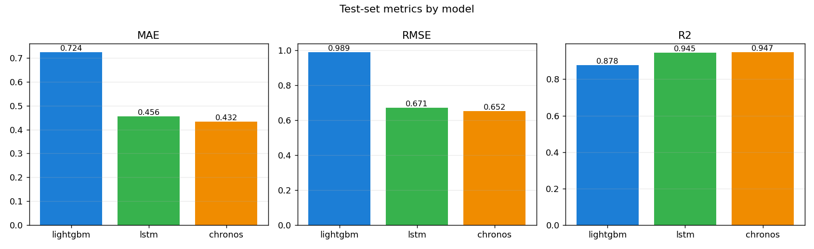
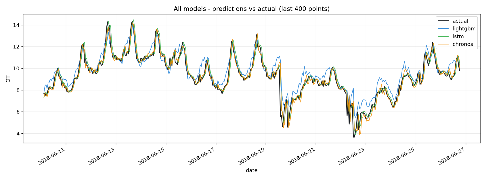
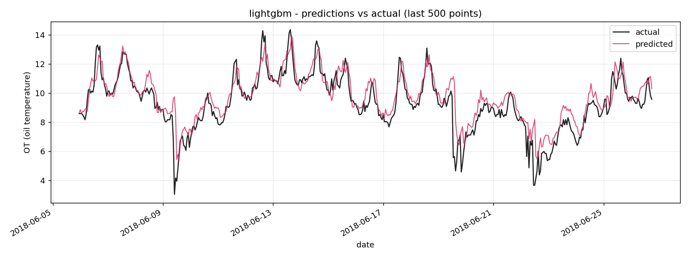
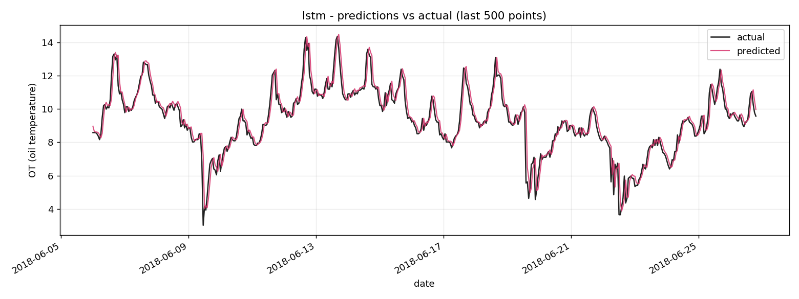
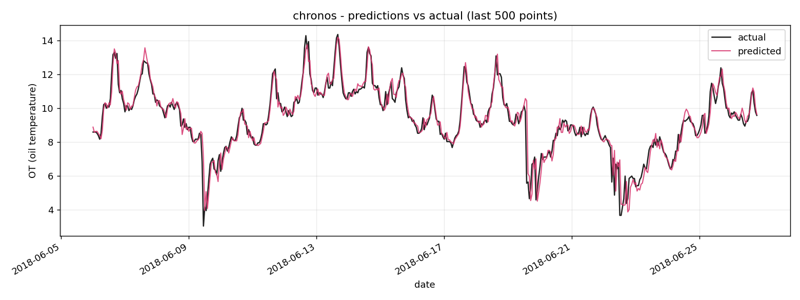
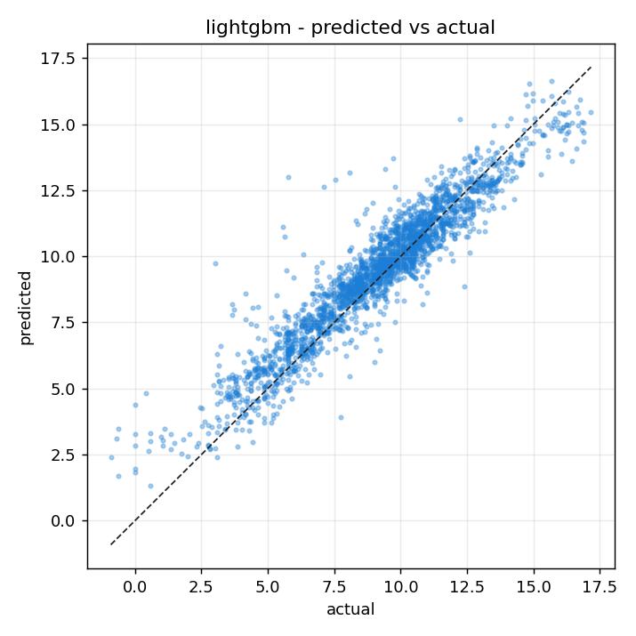
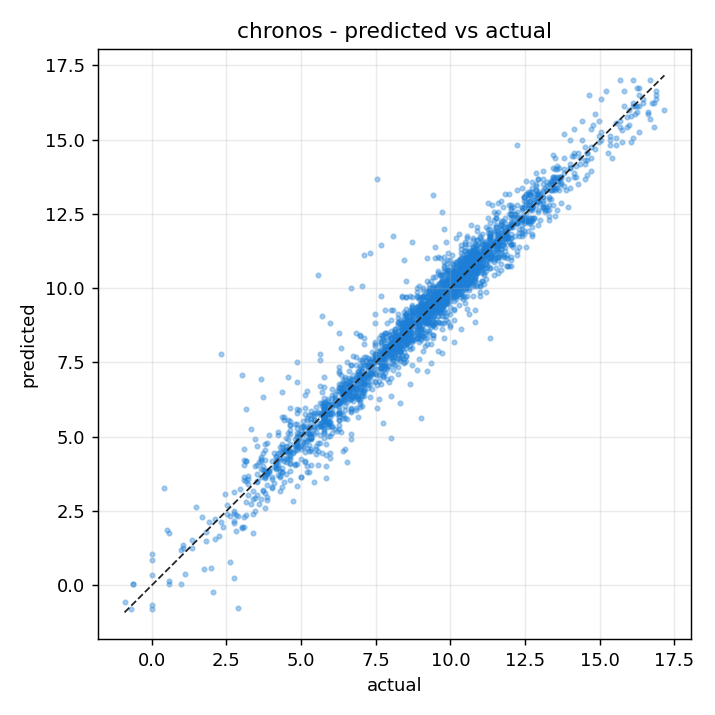
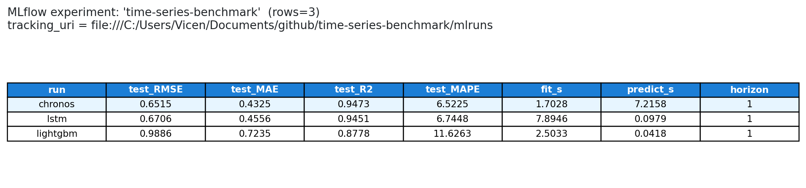

# Time-series benchmark -- LightGBM vs LSTM vs Chronos

End-to-end forecasting benchmark on ETTh1 (Electricity Transformer
Temperature, hourly): LightGBM with engineered lag/rolling/calendar features,
an LSTM trained from scratch in PyTorch, and Amazon's Chronos-Bolt evaluated
zero-shot. Every run is tracked with MLflow and a 15-test pytest suite runs
on every push across Python 3.10-3.12 in GitHub Actions.

> Forecasting horizon: 1 hour ahead. Target: `OT` (oil temperature, C).
> Train/val/test split is **temporal** (70 / 15 / 15), never randomised.

## Table of contents

- [Overview](#overview)
  - [Stack](#stack)
  - [Architecture](#architecture)
  - [Project structure](#project-structure)
- [Results on ETTh1 test set](#results-on-etth1-test-set)
- [When to use which model](#when-to-use-which-model)
- [Reproducing the benchmark](#reproducing-the-benchmark)
- [Methodology details](#methodology-details)
- [CI / MLOps](#ci--mlops)
- [Tests](#tests)
- [Limitations and natural next steps](#limitations-and-natural-next-steps)
- [Reference](#reference)
  - [Tunables](#tunables)
  - [Common commands](#common-commands)
  - [Conventions](#conventions)
  - [License](#license)

## Overview

### Stack

| Layer | Choice |
|---|---|
| Language | Python 3.10 / 3.11 / 3.12 |
| Tabular baseline | LightGBM |
| Sequence model | PyTorch LSTM (2 layers, hidden 64, 96-hour input window) |
| Foundation model | `amazon/chronos-bolt-small` (zero-shot) |
| Feature engineering | pandas + numpy (leak-safe lags / rolling / calendar) |
| Metrics | scikit-learn (MAE, RMSE, R2) + safe MAPE |
| Experiment tracking | MLflow (file-store) |
| Plotting | matplotlib |
| Tests | pytest (3.10 / 3.11 / 3.12 matrix) |
| CI | GitHub Actions (tests on every push/PR + optional retraining job) |
| Dataset | ETTh1 (introduced by the Informer paper, hourly) |

### Architecture



### Project structure

```
time-series-benchmark/
|-- src/
|   |-- config.py             # all paths, splits and hyperparameters in one place
|   |-- data.py               # ETTh1 download + temporal split + synthetic fallback
|   |-- features.py           # lag / rolling / calendar feature engineering
|   |-- evaluation.py         # MAE, RMSE, R2, MAPE, results dataframe
|   |-- plotting.py           # matplotlib helpers (overlay, scatter, residuals, bars)
|   |-- train.py              # train + evaluate + log to MLflow
|   `-- models/
|       |-- base.py
|       |-- lightgbm_model.py
|       |-- lstm_model.py
|       `-- chronos_model.py
|-- scripts/
|   |-- download_data.py
|   |-- download_chronos.py
|   |-- run_benchmark.py
|   `-- render_mlflow_summary.py
|-- tests/                    # pytest suite (data, features, metrics, model smoke)
|-- results/
|   |-- figures/              # all PNGs shown below
|   `-- tables/               # benchmark_summary.csv/.md + per-model predictions
|-- .github/workflows/
|   |-- tests.yml             # CI on every push/PR across Python 3.10-3.12
|   `-- retrain.yml           # optional retraining on changes + artefact upload
|-- requirements.txt
|-- pyproject.toml
`-- README.md
```

## Results on ETTh1 test set

| model    |    MAE |   RMSE |     R2 |    MAPE |    n | fit (s) | predict (s) |
|:---------|-------:|-------:|-------:|--------:|-----:|--------:|------------:|
| **chronos**  | **0.4325** | **0.6515** | **0.9473** |  **6.52%** | 2613 |    1.70 |        7.22 |
| lstm     | 0.4556 | 0.6706 | 0.9451 |  6.74% | 2517 |    7.90 |        0.10 |
| lightgbm | 0.7235 | 0.9886 | 0.8778 | 11.63% | 2444 |    2.50 |        0.04 |

Chronos wins on every error metric **without any training** -- a clean demonstration of why foundation models for time series are interesting today. LSTM is a very close second; LightGBM trails because the series is dominated by short autoregressive structure that lag features alone don't capture as well as a sequence model.



### Predictions vs actual (last 400 hours of the test set)



<details>
<summary>Per-model prediction plots</summary>

| LightGBM | LSTM | Chronos |
|---|---|---|
|  |  |  |
|  |  |  |

</details>

<sub>Hardware: NVIDIA RTX 4070 Ti SUPER (CUDA). The same script runs on CPU; expect roughly 6-10x larger fit and predict times for LSTM and Chronos. The qualitative ordering (Chronos > LSTM > LightGBM in error) is stable across hardware.</sub>

## When to use which model

| Use case | Recommended | Why |
|---|---|---|
| Small/cold-start dataset, no time to train, no labels | **Chronos zero-shot** | Pre-trained on a wide corpus; works the moment you have a context window. No training infrastructure needed. |
| Long sequences with complex temporal dependencies, you have GPU + labels | **LSTM / Transformer** | Capacity to learn non-linear lag interactions and seasonal mixing the gradient booster cannot model with lag features alone. |
| Rich tabular features (exogenous variables, calendar, weather, prices) and you need fast training and interpretability | **LightGBM** | Trains in seconds, exposes feature importance, easy to deploy. Strong on multivariate problems where lags are just one of many signals. |
| Production scoring with very tight latency budgets | **LightGBM** | Order-of-magnitude faster than the sequence models at inference (0.04 s vs 7.22 s for Chronos on this dataset). |

In a real engagement the decision tree is rarely "which is the best model overall" -- it is "given my data volume, latency budget, training infrastructure and interpretability needs, which family fits". This benchmark is set up so a hiring manager can read the numbers and the table above and follow that reasoning end-to-end.

## Reproducing the benchmark

### 1. Install

```bash
python -m venv .venv
.venv\Scripts\activate    # Windows
pip install -r requirements.txt
```

The `requirements.txt` pins PyTorch through `--extra-index-url`. For CPU-only:

```bash
pip install --extra-index-url https://download.pytorch.org/whl/cpu -r requirements.txt
```

### 2. Get the data

```bash
python scripts/download_data.py
```

This pulls `ETTh1.csv` (~2.5 MB, 17 420 hourly rows from 2016-07-01 to 2018-06-26) into `data/raw/`.

### 3. (Optional) Pre-download Chronos weights

If your network blocks the HuggingFace Hub or you want offline runs:

```bash
python scripts/download_chronos.py
```

This caches the `amazon/chronos-bolt-small` weights (~183 MB) into `data/models/chronos-bolt-small/`. The runtime auto-detects the local snapshot and prefers it over the Hub.

### 4. Run the benchmark

```bash
python scripts/run_benchmark.py                          # all three models
python scripts/run_benchmark.py --models lightgbm lstm   # skip chronos
python scripts/run_benchmark.py --no-mlflow              # disable tracking
```

The script prints a summary table, dumps `results/tables/benchmark_summary.{csv,md}`, generates every plot in `results/figures/` and logs three MLflow runs.

### 5. Browse experiments in MLflow

```bash
python scripts/mlflow_ui.py
```

This wrapper sets `MLFLOW_ALLOW_FILE_STORE=true` (MLflow 3.x refuses file-store backends by default) and launches `mlflow ui` against `./mlruns/`. Then open <http://127.0.0.1:5000>. You should see one experiment (`time-series-benchmark`) with three runs sorted by `test_rmse`:



Each run logs:

- **Params** -- every hyperparameter from `src/config.py` plus split sizes.
- **Metrics** -- `train_*`, `val_*`, `test_*` for MAE / RMSE / R2 / MAPE, plus `fit_seconds` and `predict_seconds`.
- **Artefacts under `model/`** -- the fitted model itself: native LightGBM booster (`lightgbm_booster.txt`) + sklearn pickle, the LSTM `state_dict.pt` + training history + scaler statistics in `metadata.json`, or the Chronos manifest pointing at the foundation checkpoint.
- **Other artefacts** -- predictions CSV, prediction/scatter/residual PNGs, and for LightGBM the top-25 feature importance table.

## Methodology details

### Temporal split (critical)

Random shuffling would leak future information. We slice along the time axis:

```
train: 2016-07-01 00:00:00 -> 2017-11-21 01:00:00 (12 194 rows, 70%)
val  : 2017-11-21 02:00:00 -> 2018-03-09 22:00:00 ( 2 613 rows, 15%)
test : 2018-03-09 23:00:00 -> 2018-06-26 19:00:00 ( 2 613 rows, 15%)
```

Validation is used for early stopping (LightGBM and LSTM) and is extended onto the rolling context of Chronos at inference time. No data point in the test set is ever seen during training or model selection.

### LightGBM features

For each row `t` we predict `OT[t + horizon]` from features built strictly from `OT[<t]`:

- **Lags**: `OT[t-1, t-2, t-3, t-6, t-12, t-24, t-48, t-72, t-168]` (last week of hours).
- **Rolling stats** over `OT[t-1, ..., t-w]` for `w in {24, 48, 168}`: mean, std, min, max. The pre-shift is what guarantees no target leakage.
- **Calendar**: hour, day-of-week, day-of-month, month, weekend flag, plus cyclical sin/cos encodings for hour, day-of-week and month.

Hyperparameters live in [`src/config.py`](src/config.py) (`LightGBMConfig`). Validation is wired into LightGBM via `early_stopping_rounds=50`.

### LSTM architecture

- Input: sliding windows of `input_window = 96` past hours (univariate `OT`).
- 2-layer LSTM, `hidden_size=64`, dropout 0.2 between layers.
- Linear head produces the next-step forecast.
- Adam, MSE loss, gradient clipping at 1.0, batch size 64, 25 epochs max with patience 5.
- Inputs are standardised with the **train-set** mean/std (recomputed each run); the same statistics are reused at inference. No test-set statistics leak.

### Chronos zero-shot

We do **not** train. For each test point we feed the model the trailing `context_length = 512` observations (drawing from train + val + already-seen test history) and read the 1-step-ahead point forecast as the median of the predictive distribution. The model used is `amazon/chronos-bolt-small`, which runs comfortably on CPU and is a few seconds faster on GPU.

### Metrics

```python
MAE  = mean(|y_true - y_pred|)
RMSE = sqrt(mean((y_true - y_pred)**2))
R2   = 1 - SS_res / SS_tot
MAPE = 100 * mean(|y_true - y_pred| / |y_true|)   # rows with |y_true| < 1e-3 are ignored
```

All four metrics, plus the row count `n` and the train / val / test wall-clock seconds, are logged to MLflow for every run.

## CI / MLOps

The repository wires two GitHub Actions workflows:

- **`tests.yml`** -- runs the pytest suite on every push and PR, across Python 3.10 / 3.11 / 3.12, on a CPU-only PyTorch wheel. The suite covers data splits, feature engineering (lags and rolling stats checked numerically against the original series, calendar features against the index), metrics (perfect-prediction unit test plus a hand-calculated MAE/RMSE), and a smoke test of the LightGBM + LSTM training loop on synthetic data.
- **`retrain.yml`** -- manual or automatic retraining when pipeline-relevant code changes (`src/features.py`, `src/models/**`, `src/train.py`, `scripts/run_benchmark.py`). Re-runs LightGBM + LSTM end-to-end and uploads the resulting `mlruns/` and `results/` directories as workflow artefacts. Chronos is skipped in CI by default to keep the runner free of the 183 MB foundation-model download -- flip the input parameter or run it locally.

Both workflows are reproducible from the repository alone -- no secrets, no external services required.

## Tests

```bash
pytest tests/ -v
```

```
tests/test_data.py::test_synthetic_dataset_has_expected_shape                  PASSED
tests/test_data.py::test_temporal_split_is_chronological_and_sums_to_total     PASSED
tests/test_data.py::test_temporal_split_rejects_invalid_fractions              PASSED
tests/test_data.py::test_split_describe_is_human_readable                      PASSED
tests/test_evaluation.py::test_perfect_prediction_yields_zero_error_and_unit_r2 PASSED
tests/test_evaluation.py::test_metrics_match_hand_calculation                  PASSED
tests/test_evaluation.py::test_compute_metrics_validates_shape                 PASSED
tests/test_evaluation.py::test_results_dataframe_is_sorted_by_rmse             PASSED
tests/test_features.py::test_lag_features_do_not_leak_future                   PASSED
tests/test_features.py::test_rolling_window_does_not_include_current_row       PASSED
tests/test_features.py::test_calendar_features_have_expected_columns_and_ranges PASSED
tests/test_features.py::test_build_feature_matrix_aligns_target_with_horizon   PASSED
tests/test_features.py::test_build_feature_matrix_rejects_missing_target       PASSED
tests/test_models_smoke.py::test_lightgbm_runs_end_to_end                      PASSED
tests/test_models_smoke.py::test_lstm_runs_end_to_end                          PASSED

15 passed
```

The key tests (the ones I would point a reviewer at):

- `test_rolling_window_does_not_include_current_row` -- proves the `shift(1)` guard works so the rolling stat at time `t` only sees `[t-w, t-1]`, never `t` itself.
- `test_build_feature_matrix_aligns_target_with_horizon` -- proves the target at index `t` corresponds to `OT[t + horizon]`. Off-by-one bugs here would silently inflate every metric.
- `test_temporal_split_is_chronological_and_sums_to_total` -- proves the splits are time-ordered (`train.max < val.min < test.min`) and cover the dataset.

## Limitations and natural next steps

- **Univariate forecasting only.** ETTh1 has six exogenous load columns (`HUFL`, `HULL`, ...). Adding them to LightGBM is a one-line change in `features.py`; for LSTM it needs a wider input projection; for Chronos it would need a multivariate variant.
- **Single horizon (1 hour).** The pipeline is parameterised on `horizon` everywhere, so re-running the benchmark for `horizon = 24` is a config tweak -- but the longer the horizon the more aggressively LightGBM trails the sequence models, and that comparison deserves its own write-up.
- **No hyperparameter sweep.** All three models use sensible defaults from `src/config.py`. An Optuna-based sweep for LightGBM is the obvious quick win; for LSTM the Weights & Biases sweep machinery used in the sibling vision project would slot straight in.

## Reference

### Tunables

Every knob lives in [`src/config.py`](src/config.py) as a frozen dataclass.
Override at instantiation -- e.g. `LightGBMConfig(n_estimators=400)` -- or
edit the defaults to change the canonical benchmark.

| Config | What it controls |
|---|---|
| `SplitConfig` | train/val/test fractions (defaults 0.70 / 0.15 / 0.15) |
| `FeatureConfig` | lag hours, rolling windows and rolling stats for the tabular pipeline |
| `LightGBMConfig` | n_estimators, learning rate, num_leaves, regularisation, early-stopping rounds |
| `LSTMConfig` | input_window, hidden_size, num_layers, dropout, batch_size, epochs, patience |
| `ChronosConfig` | model_name (`amazon/chronos-bolt-small`), local_model_path, context_length, batch_size, device |
| `BenchmarkConfig` | the singleton bundling all of the above plus `horizon` and `random_state` |

### Common commands

```bash
python scripts/download_data.py             # 1) fetch ETTh1.csv into data/raw/
python scripts/download_chronos.py          # 2) pre-cache Chronos weights (optional)
python scripts/run_benchmark.py             # 3) full benchmark with MLflow logging
python scripts/run_benchmark.py --models lightgbm lstm   # subset of models
python scripts/render_mlflow_summary.py     # 4) regenerate results/figures/mlflow_runs.png
python scripts/mlflow_ui.py                 # 5) browse runs at http://127.0.0.1:5000
pytest tests/ -v                            # 6) test suite (15 cases, ~12s on CPU)
```

### Conventions

- Plain ASCII everywhere -- no em-dashes, curly quotes or ellipsis characters in code, comments or commit messages.
- Conventional Commits (`feat(scope)`, `fix(scope)`, `chore`, `test`, `ci`, `build`, `docs`) with short bodies on multi-file commits.
- New config entries are introduced in the same commit as the code that consumes them; nothing is pre-declared.

### License

[MIT](LICENSE).
