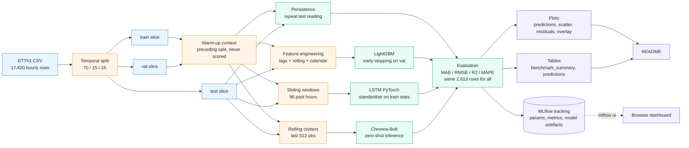
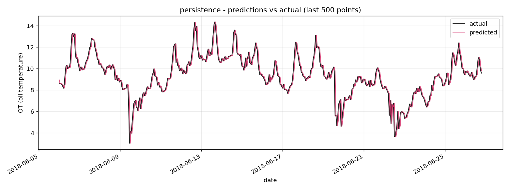
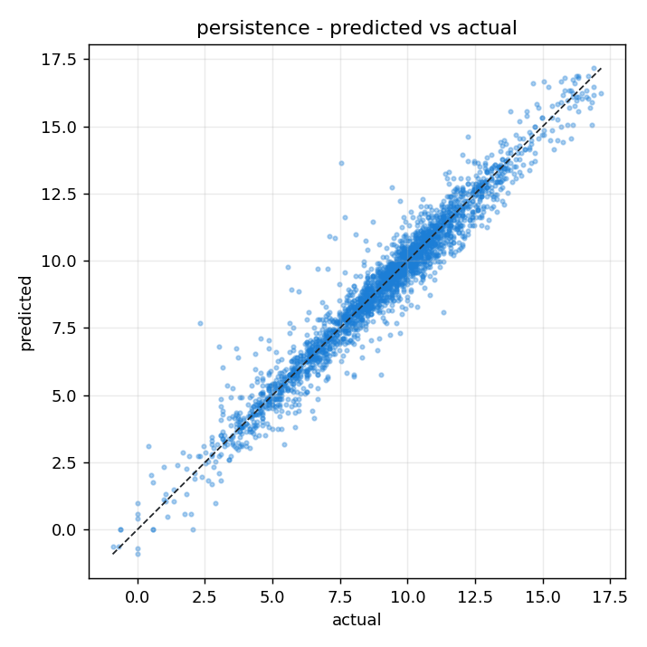

# Time-series benchmark -- does anything beat the last reading?

End-to-end forecasting benchmark on ETTh1 (Electricity Transformer
Temperature, hourly): a naive persistence baseline, LightGBM with engineered
lag/rolling/calendar features, an LSTM trained from scratch in PyTorch, and
Amazon's Chronos-Bolt evaluated zero-shot. Every run is tracked with MLflow and
a pytest suite runs on every push across Python 3.10-3.12 in GitHub Actions,
with a regression gate that blocks any pull request where a model got worse and
a drift check over the model inputs.

> Headline horizon: 1 hour ahead. Target: `OT` (oil temperature, C).
> The same pipeline is also run at 24 and 96 hours, and
> [the answer changes completely](#the-horizon-decides-the-answer).
> Train/val/test split is **temporal** (70 / 15 / 15), never randomised.
> All four models are scored on the identical 2 613 test rows, and every gap
> between them is reported with a p-value.

## Table of contents

- [Overview](#overview)
  - [Stack](#stack)
  - [Architecture](#architecture)
  - [Project structure](#project-structure)
- [Results on ETTh1 test set](#results-on-etth1-test-set)
  - [The horizon decides the answer](#the-horizon-decides-the-answer)
- [When to use which model](#when-to-use-which-model)
- [Reproducing the benchmark](#reproducing-the-benchmark)
- [Methodology details](#methodology-details)
- [CI / MLOps](#ci--mlops)
  - [The regression gate](#the-regression-gate)
  - [Input drift](#input-drift)
- [Tests](#tests)
- [Limitations and natural next steps](#limitations-and-natural-next-steps)
- [Reference](#reference)
  - [Tunables](#tunables)
  - [Common commands](#common-commands)
  - [Conventions](#conventions)
  - [License](#license)

## Overview

### Stack

| Layer | Choice |
|---|---|
| Language | Python 3.10 / 3.11 / 3.12 |
| Reference baseline | naive persistence (`OT[t] = OT[t-1]`) |
| Tabular model | LightGBM |
| Sequence model | PyTorch LSTM (2 layers, hidden 64, 96-hour input window) |
| Foundation model | `amazon/chronos-bolt-small` (zero-shot) |
| Feature engineering | pandas + numpy (leak-safe lags / rolling / calendar) |
| Metrics | scikit-learn (MAE, RMSE, R2) + safe MAPE |
| Significance | Diebold-Mariano with Newey-West variance (numpy, no scipy dependency) |
| Drift | PSI + two-sample KS (numpy, no scipy dependency) |
| Experiment tracking | MLflow (file-store) |
| Plotting | matplotlib |
| Tests | pytest (3.10 / 3.11 / 3.12 matrix) |
| CI | GitHub Actions (tests, benchmark regression gate, retraining job) |
| Dataset | ETTh1 (introduced by the Informer paper, hourly) |

### Architecture



### Project structure

```
time-series-benchmark/
|-- src/
|   |-- config.py             # all paths, splits and hyperparameters in one place
|   |-- data.py               # ETTh1 download + temporal split + synthetic fallback
|   |-- features.py           # lag / rolling / calendar feature engineering
|   |-- evaluation.py         # MAE, RMSE, R2, MAPE, results dataframe
|   |-- significance.py       # Diebold-Mariano: are the gaps real?
|   |-- quality_gate.py       # baseline-vs-candidate comparison used by CI
|   |-- drift.py              # PSI + KS distribution drift statistics
|   |-- plotting.py           # matplotlib helpers (overlay, scatter, residuals, bars)
|   |-- train.py              # train + evaluate + log to MLflow
|   `-- models/
|       |-- base.py
|       |-- persistence.py
|       |-- lightgbm_model.py
|       |-- lstm_model.py
|       `-- chronos_model.py
|-- scripts/
|   |-- download_data.py
|   |-- download_chronos.py
|   |-- run_benchmark.py
|   |-- check_regression.py
|   |-- check_drift.py
|   `-- render_mlflow_summary.py
|-- tests/                    # data, features, metrics, models, significance,
|                             #   drift, regression gate
|-- results/
|   |-- figures/              # all PNGs shown below
|   `-- tables/               # benchmark_summary.csv/.md, significance.csv,
|                             #   baseline_cpu.csv, drift_reference.csv, predictions
|-- .github/workflows/
|   |-- tests.yml             # CI on every push/PR across Python 3.10-3.12
|   |-- benchmark-gate.yml    # reruns the benchmark on PRs, blocks regressions
|   `-- retrain.yml           # retraining on changes, gated, + artefact upload
|-- requirements.txt
|-- pyproject.toml
`-- README.md
```

## Results on ETTh1 test set

| model    |    MAE |   RMSE |     R2 |    MAPE |    n | p vs baseline | fit (s) | predict (s) |
|:---------|-------:|-------:|-------:|--------:|-----:|--------------:|--------:|------------:|
| chronos  | 0.4325 | 0.6515 | 0.9473 |  6.52% | 2613 | 0.384 |    1.28 |        7.35 |
| _persistence_ | _0.4448_ | _0.6589_ | _0.9461_ | _6.45%_ | 2613 | -- |    0.00 |        0.00 |
| lstm     | 0.4556 | 0.6690 | 0.9445 |  6.70% | 2613 | 0.079 |    6.58 |        0.08 |
| lightgbm | 0.4837 | 0.6909 | 0.9408 |  7.98% | 2613 | 0.011 |    2.37 |        0.05 |

**Read the second row first.** `persistence` is not a model. It forecasts `OT[t]` as `OT[t-1]`, costs nothing to fit and nothing to run. Chronos comes out 1.1% ahead of it on RMSE and behind it on MAPE; the LSTM and LightGBM, both trained on 12 194 hours, are behind it on everything.

**Read the p-value column second, because it is what the ranking is worth.** None of the three trained models is distinguishable from repeating the last reading, and the one that *is* distinguishable is distinguishably worse:

| pair | delta RMSE | DM | p | verdict |
|:---|---:|---:|---:|:---|
| chronos vs lightgbm | -0.0394 | -2.96 | 0.0031 | distinguishable |
| persistence vs lightgbm | -0.0320 | -2.55 | 0.0108 | distinguishable |
| lstm vs chronos | +0.0175 | +1.98 | 0.0472 | distinguishable |
| lightgbm vs lstm | +0.0219 | +1.73 | 0.0832 | not distinguishable |
| persistence vs lstm | -0.0101 | -1.76 | 0.0786 | not distinguishable |
| persistence vs chronos | +0.0074 | +0.87 | 0.3837 | not distinguishable |

Diebold-Mariano on squared errors over the same 2 613 rows, Newey-West variance so the serial correlation in hourly errors is not read as evidence. `results/tables/significance.csv` carries the full matrix.

So the honest reading of this benchmark is:

- **Nothing here beats doing nothing.** Chronos' 1.1% edge over persistence has p = 0.38. On this window it is noise. Sorting the table by RMSE and calling the top row the winner would be reporting a coin flip.
- **LightGBM is genuinely worse than the baseline** (p = 0.011), which is the one clear negative result.
- **What does survive** is narrower and still worth something: Chronos beats LightGBM (p = 0.003) and the LSTM (p = 0.047) without seeing a single training example. A foundation model matching a tuned gradient booster zero-shot is interesting. Beating the naive baseline is a claim this data does not support.

Two things are worth saying about *why*, both visible elsewhere in this repo. Hourly oil temperature is dominated by a near-random-walk component, so one hour out the last reading is already most of the available signal. And [25 of the 33 model inputs are significantly drifted](#input-drift) between the training window and the test window, so the trained models are applying structure learned on one temperature regime to another, while persistence carries no level information and is immune to the shift.

Report the same four error columns without the naive row and without the p-values, and the table invites the opposite conclusion on both counts. That is the reason both are in it.


### Predictions vs actual (last 400 hours of the test set)


<details>
<summary>Per-model prediction plots</summary>

| Persistence | LightGBM | LSTM | Chronos |
|---|---|---|---|
|  |  |  |  |
|  |  |  |  |

</details>

<sub>Hardware: NVIDIA RTX 4070 Ti SUPER (CUDA). The same script runs on CPU; expect roughly 6-10x larger fit and predict times for LSTM and Chronos. The error ordering (chronos, persistence, lstm, lightgbm) is stable across hardware; the persistence row is deterministic and identical everywhere.</sub>

### The horizon decides the answer

Everything above forecasts one hour ahead, which is the horizon that flatters
the baseline most. The pipeline takes `--horizon`, so the same code, split and
seeds run further out; those tables live beside the canonical ones, under
[`results/tables/h24/`](results/tables/h24/) and
[`results/tables/h96/`](results/tables/h96/).

| horizon | persistence RMSE | best model | its RMSE | p vs persistence | verdict |
|---:|---:|:---|---:|---:|:---|
| 1 h | 0.6589 | chronos | 0.6515 | 0.38 | **indistinguishable from doing nothing** |
| 24 h | 2.2656 | chronos | **1.1392** | 4e-16 | chronos halves the error |
| 96 h | 4.0116 | chronos | **1.7829** | <1e-16 | chronos is 2.2x better |

Read per model rather than per horizon and the same table answers the only
question that matters before buying a model: **at what point does training one
start paying for itself?** Each cell is that model's test RMSE against the
persistence RMSE for that horizon, with the Diebold-Mariano p-value; `tie` means
the gap is not distinguishable from zero at the 5% level, in either direction.

| model | 1 h | 24 h | 96 h |
|:---|:---|:---|:---|
| **chronos** (zero-shot) | tie -- 0.6515 vs 0.6589 (p = 0.38) | **better** -- 1.1392 vs 2.2656 (p = 4e-16) | **better** -- 1.7829 vs 4.0116 (p < 1e-16) |
| **lstm** | tie -- 0.6690 vs 0.6589 (p = 0.079) | **better** -- 2.1203 vs 2.2656 (p = 0.003) | **better** -- 3.2290 vs 4.0116 (p = 3e-14) |
| **lightgbm** | **worse** -- 0.6909 vs 0.6589 (p = 0.011) | tie -- 2.4564 vs 2.2656 (p = 0.074) | **better** -- 3.4368 vs 4.0116 (p = 0.0005) |

Three different answers to "is this model worth it", from the same code, data
and seeds. Chronos and the LSTM are dead weight at one hour and clearly worth
their cost from 24 hours out; LightGBM is the slowest to earn its keep, actively
harmful at one hour and only ahead of doing nothing at 96. Nothing in the
one-hour column would justify a training pipeline, and nothing in the 96-hour
column would justify skipping one. At 96 h persistence itself reaches
R2 = -1.00 -- worse than predicting the mean, which is what a naive baseline is
supposed to look like once the horizon is long enough to matter.

**Why one hour is degenerate**, in four numbers straight from the pinned CSV:

| measure | value | reading |
|---|---:|---|
| lag-1 autocorrelation of `OT` | 0.994 | the current reading almost is the next one |
| standard deviation of `OT` | 8.57 C | how much the series moves across the year |
| standard deviation of the hourly change | 0.92 C | how much it moves in an hour: 11% of that |
| lag-1 autocorrelation of those changes | **-0.012** | what is left to predict is white noise |

```bash
python -c "import pandas as pd; s = pd.read_csv('data/raw/ETTh1.csv')['OT']; print(s.autocorr(1), s.diff().dropna().autocorr(1))"
```

Oil in a transformer has thermal inertia; it cannot jump. Over one hour it moves
0.44 C on average in the test window, and the hour-to-hour changes are
uncorrelated, so a model has 0.44 C of almost pure noise to work with. When a
series is close to a random walk, persistence is not a weak opponent, it is
near-optimal by construction -- the same reason a random walk has beaten
econometric exchange-rate models since Meese and Rogoff (1983). Push the horizon
out and the level itself becomes predictable again, which is where a model earns
its cost.

The lesson generalises past this dataset: **the horizon is part of the question,
not a setting**. A benchmark that reports one horizon has measured how much
inertia the series has, not how good the models are.

## When to use which model

| Use case | Recommended | Why |
|---|---|---|
| Short horizon on a strongly autocorrelated series | **Persistence** | Free, exact and hard to beat. Establish this number before anything else: on ETTh1 at 1 hour no trained model here is distinguishable from it, and one is measurably worse. By 24 hours it has stopped being competitive. |
| Small/cold-start dataset, no time to train, no labels | **Chronos zero-shot** | Pre-trained on a wide corpus; works the moment you have a context window. No training infrastructure needed. |
| Long sequences with complex temporal dependencies, you have GPU + labels | **LSTM / Transformer** | Capacity to learn non-linear lag interactions and seasonal mixing the gradient booster cannot model with lag features alone. |
| Rich tabular features (exogenous variables, calendar, weather, prices) and you need fast training and interpretability | **LightGBM** | Trains in seconds, exposes feature importance, easy to deploy. Strong on multivariate problems where lags are just one of many signals. |
| Production scoring with very tight latency budgets | **LightGBM** | Two orders of magnitude faster than Chronos at inference (0.044 s vs 7.37 s over the same 2 613 rows). |

In a real engagement the decision tree is rarely "which is the best model overall" -- it is "given my data volume, latency budget, training infrastructure and interpretability needs, **and how far ahead you have to see**, which family fits". The first row matters most, because the first question is whether a model is needed at all: on this series the measured answer is no at one hour and yes from 24 hours out.

## Reproducing the benchmark

### 1. Install

```bash
python -m venv .venv
.venv\Scripts\activate    # Windows
pip install -r requirements.txt
```

The `requirements.txt` pins PyTorch through `--extra-index-url`. For CPU-only:

```bash
pip install --extra-index-url https://download.pytorch.org/whl/cpu -r requirements.txt
```

### 2. Get the data

```bash
python scripts/download_data.py
```

This pulls `ETTh1.csv` (~2.5 MB, 17 420 hourly rows from 2016-07-01 to 2018-06-26) into `data/raw/`.

### 3. (Optional) Pre-download Chronos weights

If your network blocks the HuggingFace Hub or you want offline runs:

```bash
python scripts/download_chronos.py
```

This caches the `amazon/chronos-bolt-small` weights (~183 MB) into `data/models/chronos-bolt-small/`. The runtime auto-detects the local snapshot and prefers it over the Hub.

### 4. Run the benchmark

```bash
python scripts/run_benchmark.py                          # all four models
python scripts/run_benchmark.py --models persistence lightgbm   # a subset
python scripts/run_benchmark.py --no-mlflow              # disable tracking
```

The script prints a summary table, dumps `results/tables/benchmark_summary.{csv,md}`, generates every plot in `results/figures/` and logs four MLflow runs.

### 5. Browse experiments in MLflow

```bash
python scripts/mlflow_ui.py
```

This wrapper sets `MLFLOW_ALLOW_FILE_STORE=true` (MLflow 3.x refuses file-store backends by default) and launches `mlflow ui` against `./mlruns/`. Then open <http://127.0.0.1:5000>. You should see one experiment (`time-series-benchmark`) with four runs sorted by `test_rmse`:


Each run logs:

- **Params** -- every hyperparameter from `src/config.py`, the split sizes and `context_rows` (how much warm-up history the model was handed).
- **Metrics** -- `train_*`, `val_*`, `test_*` for MAE / RMSE / R2 / MAPE, plus `fit_seconds` and `predict_seconds`.
- **Artefacts under `model/`** -- the fitted model itself: native LightGBM booster (`lightgbm_booster.txt`) + sklearn pickle, the LSTM `state_dict.pt` + training history + scaler statistics in `metadata.json`, or the Chronos manifest pointing at the foundation checkpoint.
- **Other artefacts** -- predictions CSV, prediction/scatter/residual PNGs, and for LightGBM the top-25 feature importance table.

## Methodology details

### Temporal split (critical)

Random shuffling would leak future information. We slice along the time axis:

```
train: 2016-07-01 00:00:00 -> 2017-11-21 01:00:00 (12 194 rows, 70%)
val  : 2017-11-21 02:00:00 -> 2018-03-09 22:00:00 ( 2 613 rows, 15%)
test : 2018-03-09 23:00:00 -> 2018-06-26 19:00:00 ( 2 613 rows, 15%)
```

Validation is used for early stopping (LightGBM and LSTM). No data point in the test set is ever seen during training or model selection.

### Warm-up comes from outside the scored slice

Every model needs some history before it can emit its first forecast: 1 row for persistence, 96 for the LSTM's input window, 168 for LightGBM's deepest lag, 512 for Chronos' context. Taking that warm-up from the front of the test slice would score each model on a different, shorter window -- the deeper the lag, the later it starts -- and then line those errors up in one table as if they were comparable.

Instead each forecaster declares `context_rows`, and `train_and_evaluate` hands it the tail of the preceding split: train warms up val, and train+val warms up test. The warm-up rows are never scored. All four models therefore report `n = 2613` over the identical period, which is what makes the summary table a comparison of models rather than of windows.

### LightGBM features

Each row is labelled with the timestamp it predicts: row `t` carries `OT[t]`, and every lag and rolling feature on it reaches no later than `OT[t - horizon]`.

- **Lags**: at `horizon = 1`, `OT[t-1, t-2, t-3, t-6, t-12, t-24, t-48, t-72, t-168]` (last week of hours). A larger horizon pushes all of them back by `horizon - 1`.
- **Rolling stats** over the window ending at `OT[t - horizon]` for `w in {24, 48, 168}`: mean, std, min, max. The pre-shift is what guarantees no target leakage.
- **Calendar**: hour, day-of-week, day-of-month, month, weekend flag, plus cyclical sin/cos encodings for hour, day-of-week and month. The clock is known in advance, so these are read off `t` itself.

The horizon is pinned by `test_effective_horizon_matches_requested_horizon` rather than left to shift arithmetic: a matrix that is one step off still trains, still predicts and still produces plausible metrics -- it just quietly scores the model at a longer horizon than the one in the table header.

Hyperparameters live in [`src/config.py`](src/config.py) (`LightGBMConfig`). Validation is wired into LightGBM via `early_stopping_rounds=50`.

### LSTM architecture

- Input: sliding windows of `input_window = 96` past hours (univariate `OT`).
- 2-layer LSTM, `hidden_size=64`, dropout 0.2 between layers.
- Linear head produces the next-step forecast.
- Adam, MSE loss, gradient clipping at 1.0, batch size 64, 25 epochs max with patience 5.
- Inputs are standardised with the **train-set** mean/std (recomputed each run); the same statistics are reused at inference. No test-set statistics leak.

### Chronos zero-shot

We do **not** train. For each test point we feed the model the trailing `context_length = 512` observations (the warm-up tail of train + val, then already-scored test rows as the window rolls forward) and read the 1-step-ahead point forecast as the median of the predictive distribution. The model used is `amazon/chronos-bolt-small`, which runs comfortably on CPU and is a few seconds faster on GPU.

### Is the difference real?

Four models, six pairs, and a spread of under 6% between first and last. At that
scale a ranking is worth nothing without a test, so `src/significance.py`
compares every pair with Diebold-Mariano on the loss differential
`d[t] = e_a[t]^2 - e_b[t]^2`, using a Newey-West variance with the standard
`floor(4 * (n/100)^(2/9))` bandwidth. Hourly forecast errors are serially
correlated; without the lag correction that autocorrelation reads as extra
evidence and inflates every statistic.

The check that matters most is the one on the null: two forecasters of equal
quality must be called apart about 5% of the time, no more.
`test_false_positive_rate_stays_near_the_nominal_five_percent` runs 300
independent pairs of equally noisy forecasts and asserts the rejection rate
sits near the nominal level, which is the property a single seeded example
cannot establish -- roughly one seed in twenty lands the wrong side of 0.05,
and that is the test working rather than failing.

### The dataset is pinned

`ETTH1_URL` points at a branch on GitHub, not a tag, so the file can change
under the repository without warning. `src/config.py` records its SHA-256 and
`load_etth1` verifies it on every read, which is what makes the numbers in this
README reproducible rather than merely re-runnable. Pass
`verify_checksum=False` to work against a modified copy on purpose; if the
upstream file legitimately changes, re-pin the digest and regenerate both the
results and the drift reference against it.

### Metrics

```python
MAE  = mean(|y_true - y_pred|)
RMSE = sqrt(mean((y_true - y_pred)**2))
R2   = 1 - SS_res / SS_tot
MAPE = 100 * mean(|y_true - y_pred| / |y_true|)   # rows with |y_true| < 1e-3 are ignored
```

All four metrics, plus the row count `n` and the train / val / test wall-clock seconds, are logged to MLflow for every run.

## CI / MLOps

The repository wires three GitHub Actions workflows:

- **`tests.yml`** -- runs the pytest suite on every push and PR, across Python 3.10 / 3.11 / 3.12, on a CPU-only PyTorch wheel. The suite covers data splits, feature engineering (lags and rolling stats checked numerically against the original series, calendar features against the index), the effective forecast horizon, metrics, the regression gate itself, and a smoke test of the training loops on synthetic data.
- **`benchmark-gate.yml`** -- reruns the benchmark on every pull request, refuses to go green if a model got worse, and checks the input distributions against the recorded reference. See below.
- **`retrain.yml`** -- manual or automatic retraining when pipeline-relevant code changes (`src/features.py`, `src/models/**`, `src/train.py`, `scripts/run_benchmark.py`). Runs the same gate, then uploads `mlruns/` and `results/` as workflow artefacts. Chronos is skipped in CI by default to keep the runner free of the 183 MB foundation-model download -- flip the input parameter or run it locally.

All three are reproducible from the repository alone -- no secrets, no external services required.

### The regression gate

Retraining that never checks its own output is not a safety net; it is an automated way to publish a worse model. `scripts/check_regression.py` closes that loop: it reruns persistence, LightGBM and the LSTM on the PR's code and compares them against `results/tables/baseline_cpu.csv`, failing the build when

- any model's test RMSE grows by more than 3% of its baseline value,
- a model present in the baseline is missing from the run, or
- the models were not all scored on the same number of rows.

The delta table is written to the job summary and posted as a pull-request comment:

```
| model       | rmse baseline | rmse candidate |   delta |      |
|:------------|--------------:|---------------:|--------:|:----:|
| persistence |        0.6589 |         0.6589 |  +0.00% |  ok  |
| lightgbm    |        0.6909 |         0.9886 | +43.08% | FAIL |
```

Two details make it survive contact with reality rather than get switched off:

**The baseline is measured on CPU.** The canonical results in this README come from a GPU run, but CI runs on a CPU runner, and the LSTM scores 0.6690 on GPU against 0.6899 on CPU -- a 3.1% gap that would trip a 3% tolerance on the very first pull request. `baseline_cpu.csv` is a separate CPU-measured file for exactly that reason, and `run_benchmark.py --device cpu` pins the device explicitly because `CUDA_VISIBLE_DEVICES=""` is not a reliable off-switch on every platform. Persistence and LightGBM are bit-identical across both.

**The row-count check is not decoration.** This benchmark used to score its three models on 2 613, 2 517 and 2 444 rows and print the errors in one table. That is the failure the third condition exists to catch, and `test_unequal_row_counts_fail` pins it.

### Input drift

`scripts/check_drift.py` reports the PSI and KS distance between the training window and the scored window for all 33 model inputs, and fails the build if any feature's PSI moves more than 0.02 from `results/tables/drift_reference.csv`.

Be clear about what that does and does not buy. ETTh1 is a frozen CSV, so this check can never fire on real-world drift -- the number is a standing property of the split, not a live signal, and a build that goes green on it has not proved the world is stable. What it does catch is the source data or the feature pipeline quietly producing a different distribution than the one on record, which is a real failure mode and one that otherwise surfaces as a metric you have to squint at. And because a check that cannot fail is worth nothing on its own, `tests/test_drift.py` hands the detector known drift -- mean shifts of increasing size, and a variance-only shift that leaves the mean untouched -- and asserts it fires, then asserts an unshifted sample stays quiet.

The standing numbers are worth reading once:

| feature | PSI | KS | band |
|:---|---:|---:|:---|
| month | 9.2435 | 0.6388 | significant |
| month_sin | 9.1518 | 0.7006 | significant |
| OT_roll_max_168 | 8.1578 | 0.6720 | significant |
| OT_roll_mean_168 | 6.4744 | 0.5936 | significant |
| OT_lag_168 | 5.3096 | 0.5436 | significant |

25 of 33 inputs land in the significant band. The 8 that do not are exactly the intra-day and intra-week clock features -- `hour`, `dayofweek`, `is_weekend`, `day` and their cyclical encodings -- which repeat identically in any window. Everything that depends on the level of `OT`, or on where in the year the window sits, is out of distribution at test time: the split cuts a two-year series so that training sees July 2016 to November 2017 and the test window is March to June 2018.

That is worth holding next to the results table. The trained models are asked to apply structure learned on one temperature regime to another, while persistence carries no level information at all and is therefore immune to the shift. It is consistent with two of the three trained models failing to beat it, and it is the first thing I would attack -- a rolling-origin evaluation instead of a single cut -- before concluding anything about the model families.

## Tests

```bash
pytest tests/ -v
```

```
tests/test_data.py::test_synthetic_dataset_has_expected_shape                              PASSED
tests/test_data.py::test_temporal_split_is_chronological_and_sums_to_total                 PASSED
tests/test_data.py::test_temporal_split_rejects_invalid_fractions                          PASSED
tests/test_data.py::test_split_describe_is_human_readable                                  PASSED
tests/test_data.py::test_sha256_matches_hashlib                                            PASSED
tests/test_data.py::test_verify_accepts_the_expected_digest                                PASSED
tests/test_data.py::test_verify_rejects_a_changed_file                                     PASSED
tests/test_data.py::test_load_can_skip_verification                                        PASSED
tests/test_drift.py::test_identical_samples_show_no_drift                                  PASSED
tests/test_drift.py::test_same_distribution_different_draws_stays_below_the_stable_band    PASSED
tests/test_drift.py::test_disjoint_samples_saturate_ks                                     PASSED
tests/test_drift.py::test_psi_grows_with_the_size_of_the_injected_shift[0.5]               PASSED
tests/test_drift.py::test_psi_grows_with_the_size_of_the_injected_shift[1.0]               PASSED
tests/test_drift.py::test_psi_grows_with_the_size_of_the_injected_shift[2.0]               PASSED
tests/test_drift.py::test_psi_grows_with_the_size_of_the_injected_shift[4.0]               PASSED
tests/test_drift.py::test_psi_catches_a_variance_only_shift                                PASSED
tests/test_drift.py::test_constant_reference_is_handled                                    PASSED
tests/test_drift.py::test_empty_input_yields_nan                                           PASSED
tests/test_drift.py::test_invalid_bins_rejected                                            PASSED
tests/test_drift.py::test_report_flags_only_the_drifted_column                             PASSED
tests/test_drift.py::test_report_on_a_shifted_synthetic_series                             PASSED
tests/test_drift.py::test_report_rejects_missing_columns                                   PASSED
tests/test_drift.py::test_markdown_lists_the_worst_offender_first                          PASSED
tests/test_drift.py::test_unmoved_psi_passes                                               PASSED
tests/test_drift.py::test_moved_psi_is_reported                                            PASSED
tests/test_drift.py::test_missing_and_unexpected_features_are_reported                     PASSED
tests/test_drift.py::test_negative_tolerance_rejected                                      PASSED
tests/test_evaluation.py::test_perfect_prediction_yields_zero_error_and_unit_r2            PASSED
tests/test_evaluation.py::test_metrics_match_hand_calculation                              PASSED
tests/test_evaluation.py::test_compute_metrics_validates_shape                             PASSED
tests/test_evaluation.py::test_results_dataframe_is_sorted_by_rmse                         PASSED
tests/test_features.py::test_lag_features_do_not_leak_future                               PASSED
tests/test_features.py::test_lag_offset_pushes_every_lag_further_back                      PASSED
tests/test_features.py::test_rolling_window_does_not_include_current_row                   PASSED
tests/test_features.py::test_calendar_features_have_expected_columns_and_ranges            PASSED
tests/test_features.py::test_build_feature_matrix_labels_rows_with_the_predicted_timestamp PASSED
tests/test_features.py::test_effective_horizon_matches_requested_horizon[1]                PASSED
tests/test_features.py::test_effective_horizon_matches_requested_horizon[2]                PASSED
tests/test_features.py::test_effective_horizon_matches_requested_horizon[3]                PASSED
tests/test_features.py::test_build_feature_matrix_rejects_missing_target                   PASSED
tests/test_features.py::test_build_feature_matrix_rejects_non_positive_horizon             PASSED
tests/test_models_smoke.py::test_lightgbm_runs_end_to_end                                  PASSED
tests/test_models_smoke.py::test_lstm_runs_end_to_end                                      PASSED
tests/test_models_smoke.py::test_persistence_repeats_the_last_observation                  PASSED
tests/test_models_smoke.py::test_persistence_needs_no_training                             PASSED
tests/test_models_smoke.py::test_every_model_is_scored_on_the_same_rows                    PASSED
tests/test_models_smoke.py::test_missing_context_shortens_the_scored_window                PASSED
tests/test_models_smoke.py::test_context_must_precede_the_scored_frame                     PASSED
tests/test_models_smoke.py::test_chronos_context_handling_reproduces_persistence           PASSED
tests/test_models_smoke.py::test_chronos_without_context_cannot_score_the_earliest_rows    PASSED
tests/test_models_smoke.py::test_chronos_requires_a_loaded_pipeline                        PASSED
tests/test_quality_gate.py::test_identical_run_passes                                      PASSED
tests/test_quality_gate.py::test_improvement_passes                                        PASSED
tests/test_quality_gate.py::test_regression_beyond_tolerance_fails                         PASSED
tests/test_quality_gate.py::test_regression_inside_tolerance_passes                        PASSED
tests/test_quality_gate.py::test_missing_model_fails                                       PASSED
tests/test_quality_gate.py::test_unequal_row_counts_fail                                   PASSED
tests/test_quality_gate.py::test_higher_is_better_metric_flips_the_comparison              PASSED
tests/test_quality_gate.py::test_markdown_report_marks_the_failing_row                     PASSED
tests/test_quality_gate.py::test_invalid_inputs_raise                                      PASSED
tests/test_significance.py::test_identical_forecasts_are_not_distinguishable               PASSED
tests/test_significance.py::test_a_clearly_better_forecast_is_detected                     PASSED
tests/test_significance.py::test_false_positive_rate_stays_near_the_nominal_five_percent   PASSED
tests/test_significance.py::test_statistic_is_antisymmetric                                PASSED
tests/test_significance.py::test_absolute_loss_is_supported                                PASSED
tests/test_significance.py::test_serial_correlation_widens_the_interval                    PASSED
tests/test_significance.py::test_newey_west_with_no_lags_is_the_plain_variance_of_the_mean PASSED
tests/test_significance.py::test_default_lag_rule_grows_with_the_sample                    PASSED
tests/test_significance.py::test_invalid_inputs_raise                                      PASSED
tests/test_significance.py::test_pairwise_covers_every_combination                         PASSED
tests/test_significance.py::test_pairwise_separates_the_real_gap_from_the_twin             PASSED
tests/test_significance.py::test_p_values_against_a_reference                              PASSED
tests/test_significance.py::test_pairwise_uses_only_shared_rows                            PASSED
tests/test_significance.py::test_markdown_puts_the_strongest_evidence_first                PASSED

74 passed
```

The key tests (the ones I would point a reviewer at):

- `test_effective_horizon_matches_requested_horizon` -- proves the freshest observation reachable from row `t` is `t - horizon`, for `horizon` 1 to 3. An off-by-one here does not crash and does not look wrong in the metrics; it just scores the model at a longer horizon than the table claims.
- `test_every_model_is_scored_on_the_same_rows` -- proves all four forecasters return predictions for the full test index, so the summary table compares models rather than windows.
- `tests/test_quality_gate.py` -- proves the CI gate fails on a real regression and passes on machine noise, in both directions. A gate that is wrong is worse than no gate: a false pass ships the regression it exists to stop, a false failure gets switched off within a week.
- `test_psi_grows_with_the_size_of_the_injected_shift` and `test_psi_catches_a_variance_only_shift` -- prove the drift detector actually detects. Run against a frozen dataset it can only ever return the same answer, so the green tick means nothing until the detector has been shown drift it had to find.
- `test_false_positive_rate_stays_near_the_nominal_five_percent` -- proves the significance test does not manufacture winners out of noise, which is the failure mode that would quietly justify the headline this README used to carry.
- `test_chronos_context_handling_reproduces_persistence` -- runs the Chronos forecaster against a stub pipeline that repeats the last observation, so its warm-up stitching and index alignment must reproduce the persistence baseline exactly. Covers the code around the foundation model without downloading 183 MB in CI.
- `test_rolling_window_does_not_include_current_row` -- proves the pre-shift works so the rolling stat at time `t` only sees `[t-w-horizon, t-horizon]`, never the target itself.
- `test_temporal_split_is_chronological_and_sums_to_total` -- proves the splits are time-ordered (`train.max < val.min < test.min`) and cover the dataset.

## Limitations and natural next steps

- **Univariate forecasting only.** ETTh1 has six exogenous load columns (`HUFL`, `HULL`, ...). Adding them to LightGBM is a one-line change in `features.py`; for LSTM it needs a wider input projection; for Chronos it would need a multivariate variant.
- **A single test window, and the conclusions are the width of the error bars.** Everything above rests on one 2 613-row cut, and the drift numbers show that cut lands in a different regime from the training data. A rolling-origin evaluation -- several successive train/test folds walked forward through the series -- would turn each of these single numbers into a distribution and is the first thing I would add. It could plausibly move a p-value across 0.05 in either direction.
- **Three horizons, one test window.** 1, 24 and 96 hours are measured (`--horizon`), which is what turned "nothing beats the baseline" into "nothing beats it at one hour". They still share the single test cut above, so the horizon sweep inherits its regime shift; a rolling-origin evaluation would have to be run per horizon, not once.
- **No hyperparameter sweep.** All three trained models use sensible defaults from `src/config.py`. An Optuna-based sweep for LightGBM is the obvious quick win; for LSTM the Weights & Biases sweep machinery used in the sibling vision project would slot straight in. Given how narrow the margins are against persistence, tuning could plausibly change the ordering.

## Reference

### Tunables

Every knob lives in [`src/config.py`](src/config.py) as a frozen dataclass.
Override at instantiation -- e.g. `LightGBMConfig(n_estimators=400)` -- or
edit the defaults to change the canonical benchmark.

| Config | What it controls |
|---|---|
| `SplitConfig` | train/val/test fractions (defaults 0.70 / 0.15 / 0.15) |
| `FeatureConfig` | lag hours, rolling windows and rolling stats for the tabular pipeline |
| `LightGBMConfig` | n_estimators, learning rate, num_leaves, regularisation, early-stopping rounds |
| `LSTMConfig` | input_window, hidden_size, num_layers, dropout, batch_size, epochs, patience |
| `ChronosConfig` | model_name (`amazon/chronos-bolt-small`), local_model_path, context_length, batch_size, device |
| `BenchmarkConfig` | the singleton bundling all of the above plus `horizon` and `random_state` |

### Common commands

```bash
python scripts/download_data.py             # 1) fetch ETTh1.csv into data/raw/
python scripts/download_chronos.py          # 2) pre-cache Chronos weights (optional)
python scripts/run_benchmark.py             # 3) full benchmark with MLflow logging
python scripts/run_benchmark.py --models persistence lightgbm   # subset of models
python scripts/run_benchmark.py --device cpu             # pin the device (CI baselines)
python scripts/run_benchmark.py --horizon 24             # 24h ahead -> results/tables/h24/
python scripts/check_regression.py          # 4) gate this run against baseline_cpu.csv
python scripts/check_drift.py               #    PSI/KS drift, train window vs test window
python scripts/check_drift.py --write-reference          # re-record drift_reference.csv
python scripts/render_mlflow_summary.py     # 5) regenerate results/figures/mlflow_runs.png
python scripts/mlflow_ui.py                 # 6) browse runs at http://127.0.0.1:5000
pytest tests/ -v                            # 7) test suite (~14s on CPU)
```

### Conventions

- Plain ASCII everywhere -- no em-dashes, curly quotes or ellipsis characters in code, comments or commit messages.
- Conventional Commits (`feat(scope)`, `fix(scope)`, `chore`, `test`, `ci`, `build`, `docs`) with short bodies on multi-file commits.
- New config entries are introduced in the same commit as the code that consumes them; nothing is pre-declared.

### License

[MIT](LICENSE).
